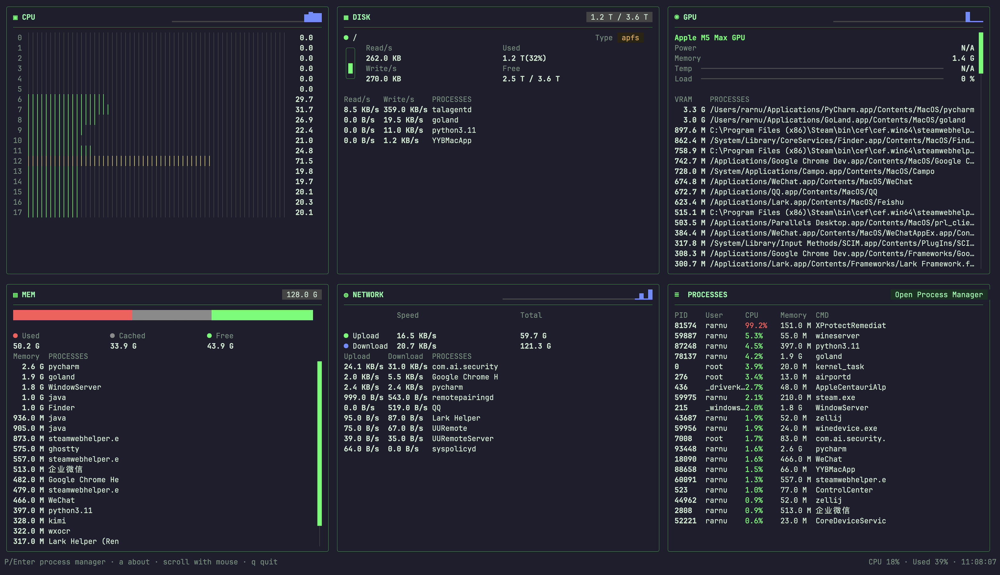

# xtop

[](https://github.com/rarnu/xtop/actions/workflows/ci.yml)

[中文](./README_zh_CN.md)

`xtop` is a Matrix-green terminal system monitor inspired by `top`. It displays CPU, memory, disk, GPU, network and process information in a compact 2x3 card dashboard, with mouse support and a built-in process manager.



## Features

- **2x3 card dashboard**: CPU, Disk, GPU on the first row; Memory, Network, Process on the second row.
- **Auto-resizing cards**: each card scales with the terminal size; vertical scrollbars appear when content overflows.
- **Mouse support**: scroll cards, drag scrollbars, click process rows, and interact with dialogs.
- **Process manager**: press `P`/`Enter` or click the button on the process card to open a full-screen process table. Sort by PID, user, status, CPU, memory, start time or command. Kill or force-kill processes directly.
- **Process detail popup**: click a process in the Memory/Network/Disk/GPU cards to view details and terminate it.
- **Multi-language**: automatically loads language files from `/etc/xtop/lang/`, `~/.xtop/lang/` or `./lang/` based on system locale. Falls back to English when a translation is missing.
- **Cross-platform**: builds on Linux (amd64/arm64) and macOS (arm64/amd64). Some platform-specific features require native CGO builds for full functionality.

## Installation

### Build from source

Requires Go 1.26 or later.

```bash
git clone https://github.com/rarnu/xtop.git
cd xtop
go build ./cmd/xtop
```

### Cross-compile

```bash
# Linux amd64
GOOS=linux GOARCH=amd64 go build ./cmd/xtop

# Linux arm64
GOOS=linux GOARCH=arm64 go build ./cmd/xtop

# MacOS arm64
GOOS=darwin GOARCH=arm64 go build ./cmd/xtop
```

## Usage

```bash
./xtop
```

| Key | Action |
|-----|--------|
| `q` / `Ctrl+C` | Quit |
| `P` / `Enter` | Open process manager |
| `a` | Open about dialog |
| `↑` / `↓` | Select process in manager |
| `1-7` or click header | Sort process table |
| `k` | Kill selected process |
| `K` / `f` | Force-kill selected process |
| `ESC` | Close dialog / back |

Use the mouse wheel to scroll cards and drag scrollbars.

## Language files

Translation files are loaded from (in priority order):

1. `/etc/xtop/lang/<locale>.json`
2. `~/.xtop/lang/<locale>.json`
3. `./lang/<locale>.json`

The locale is detected from `LC_ALL`, `LC_MESSAGES` or `LANG`. If a file is not found, English is used as fallback.

## License

[MIT](./LICENSE)
